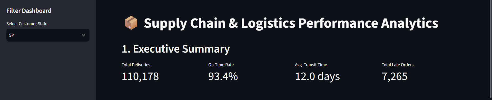
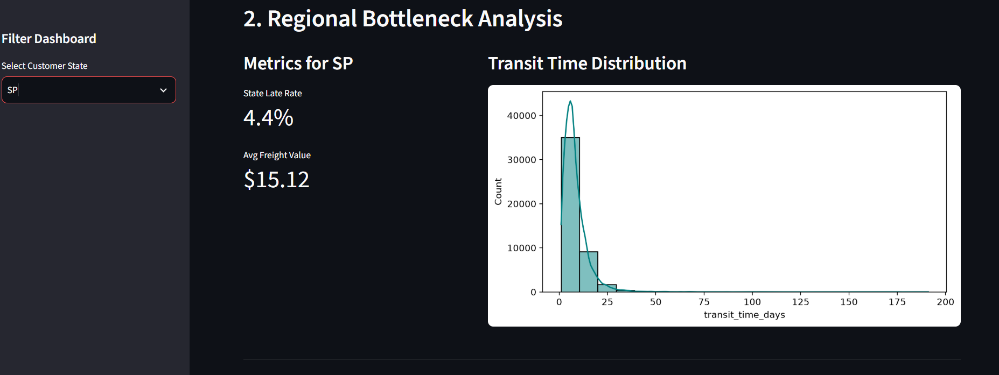
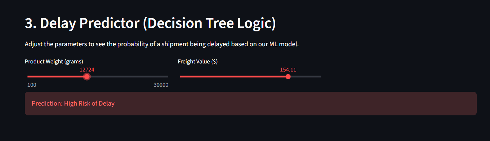
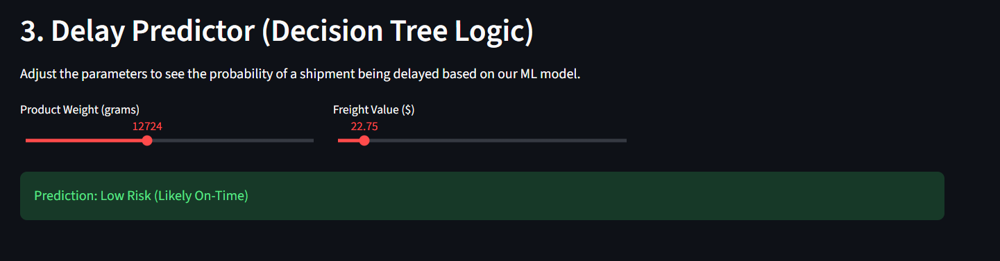

# 📦 Supply Chain & Logistics Performance Analytics

An end-to-end data analytics and machine learning pipeline built to evaluate and predict Brazilian e-commerce supply chain efficiency using the Olist dataset. This project transforms raw relational data into a clean analytical model, surfaces core logistical metrics, and deploys an interactive web dashboard with predictive capabilities.

---

## 🚀 Live Demo & Links
* **Live Web App:** [dileep-supply-chain.streamlit.app](https://dileep-supply-chain.streamlit.app/)
* **GitHub Repository:** [Supply Chain Analytics Dashboard](https://github.com/dileepkumarmallela391/supply-chain-analytics-dashboard)

---

## 📸 Dashboard Preview

### 1. High-Level Operations & Bottlenecks

| Executive Summary & High-Level KPIs | Regional Bottleneck Analysis |
| :---: | :---: |
|  |  |
| **What it shows:** Core logistical metrics such as total orders, average transit time, overall delay percentage, and top-level KPI scorecards. | **What it shows:** Geographic heatmaps and regional delivery delays, highlighting specific Brazilian states and transit corridors with the highest bottleneck risks. |

---

### 2. Predictive Delay Modeling ("What-If" Simulations)

| Predictive Risk Assessment (High Risk) | Low-Risk Route Simulation |
| :---: | :---: |
|  |  |
| **What it shows:** Scikit-Learn Decision Tree model predicting a high probability of delivery delay based on heavy product weight, long distance, or high-risk destination states. | **What it shows:** "What-If" parameter adjustments demonstrating an on-time or low-risk delivery trajectory based on optimized attributes. |

---

## 🛠️ Technology Stack
* **Language:** Python
* **Data Processing & Wrangling:** Pandas, NumPy
* **Machine Learning:** Scikit-Learn (Decision Tree Classifier)
* **Data Visualization:** Matplotlib, Seaborn
* **Deployment & Web Framework:** Streamlit & Streamlit Community Cloud

---

## 📊 Key Features & Architecture
1. **Automated Data Pipeline:** Merged multiple disparate relational files (Orders, Order Items, Customers, and Products) to calculate critical operational metrics like `transit_time_days` and `is_late` flags.
2. **Exploratory Data Analysis (EDA):** Uncovered core logistical bottlenecks by analyzing regional delivery performance, freight costs versus product weights, and carrier delays.
3. **Predictive Modeling:** Trained a Scikit-Learn Decision Tree Classifier to predict the likelihood of delivery delays based on physical product attributes and destination states.
4. **Interactive Web Dashboard:** Built an intuitive Streamlit interface allowing stakeholders to filter KPIs dynamically and run "What-If" machine learning simulations.

---

## 💻 How to Run Locally

If you want to test or run this project on your local machine, follow these steps:

1. **Clone the repository:**
   ```bash
   git clone [https://github.com/dileepkumarmallela391/supply-chain-analytics-dashboard.git](https://github.com/dileepkumarmallela391/supply-chain-analytics-dashboard.git)
   cd supply-chain-analytics-dashboard
